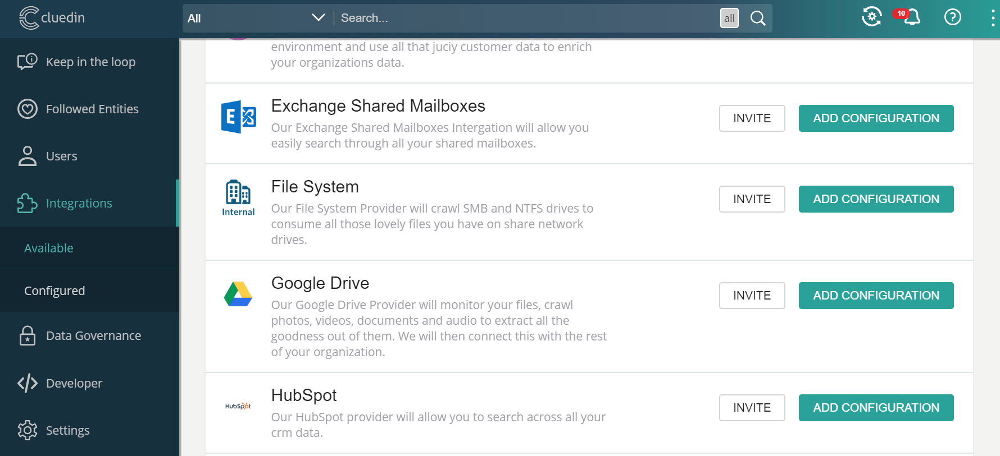
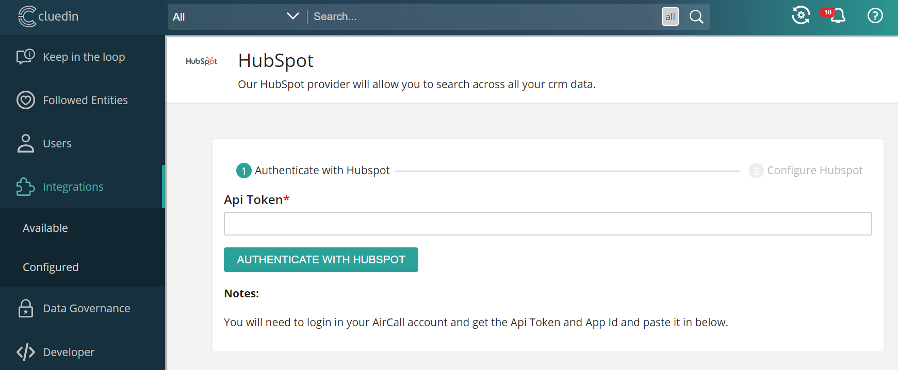
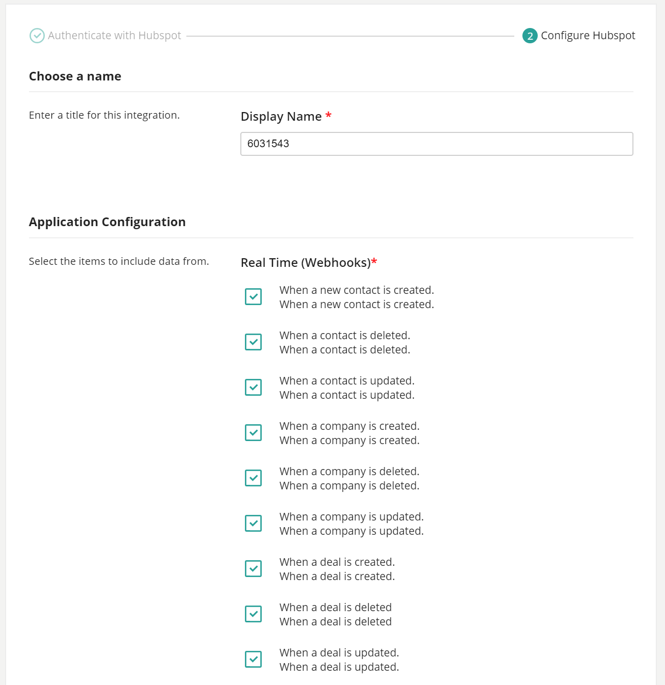
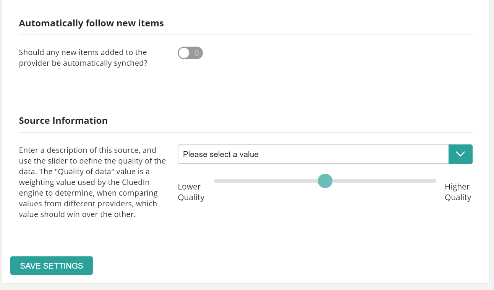
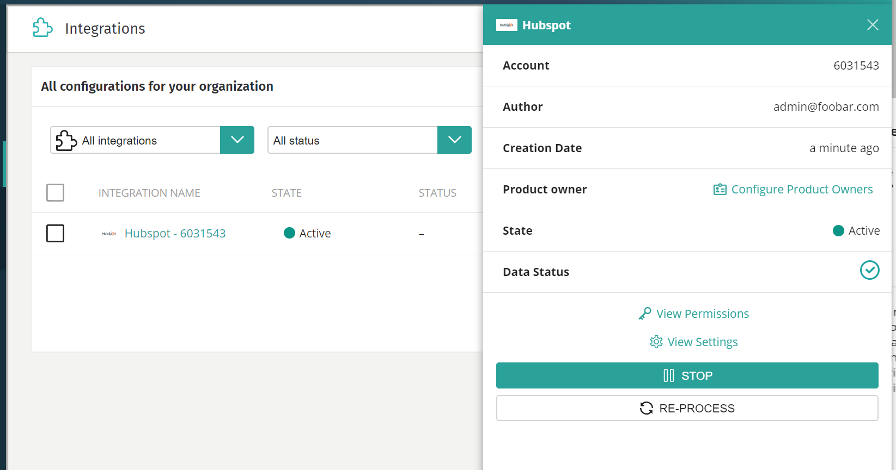

## CluedIn.Crawling.Hubspot 

CluedIn HubSpot Crawler is designed to crawl company data stored on [Hubspot CRM](https://www.hubspot.com/products/crm), covering all current editions (Free, Sales Hub, Marketing hub and Service Hub)

## Installation and Setup

Please refer to general Crawler installation documentation on how to deploy Crawlers with CluedIn Backend

To add a new Integrations:

- Click on `Integrations -> Available` menu, and then Add Configuration on the HubSpot row
  

- Enter your API Token which can be found in HubSpot settings
  

- Enter a display name, select web-hooks, other settings and click Save Settings
  

- You should now see your new Integration in the `Integrations -> Configured` menu. Clicking on the Integration will open a menu to aloow stopping, styarting and invoking recrawl etc
  

## Output

When crawling, the following HubSpot entity -> Clue mappings will be created:

| HubSpot Entity        | Clue Type                 |
|-------------------    |---------------------------|
| Blog                  | /News                     |
| Blog Post             | /News                     |
| Broadcast Message     | /Announcement             |
| Calendar Event        | /Calendar/Event           |
| Call                  | /PhoneCall                |
| Campaign              | /Marketing/Campaign       |
| Campaign Event        | /Calendar/Event           |
| Channel               | /Channel                  |
| Company               | /Organization             |
| Contact               | /Infrastructure/Contact   |
| Contact List          | /List                     |
| Deal                  | /Sales/Deal               |
| Deal Pipeline         | /Process                  |
| Domain                | /Note                     |
| Email                 | /Mail                     |
| Email Person          | /Person                   |
| Engagement Activity   | /Activity                 |
| Engagement            | /Activity                 |
| File Metadata         | /Files/File               |
| Form                  | /Form                     |
| Keyword               | /Tag                      |
| Line Item             | /Sales/Order              |
| Meeting               | /Calendar/Meeting         |
| Note                  | /Note                     |
| Owner                 | /Person                   |
| Product               | /Product                  |
| Property Definition|  | /Note                     |
| Row (Table)           | /List/ListItem            |
| Sitemap               | /News                     |
| Smtp Token            | /Activity                 |
| Table                 | /List                     |
| Task                  | /Task                     |
| Template              | /Template                 |
| Ticket                | /Support/Ticket           |
| Topic                 | /Topic                    |
| Url Mapping           | /Note                     |
| Workflow              | /Process                  |
